# 核心概念与参数详解

> **速查入口**：如果你已经了解 RAG 基础，只想调参，直接跳到 [六、可调参数一览](#六可调参数一览)。
>
> 如果你是新手，建议按顺序阅读，每节都配有原理图和代码对应关系。

---

## 一、RAG 整体架构

RAG（Retrieval-Augmented Generation，检索增强生成）的核心思想很简单：**先查资料，再回答**。LLM 本身不知道你的私有文档内容，RAG 就是把相关文档片段找出来后塞给 LLM，让它基于这些片段作答。

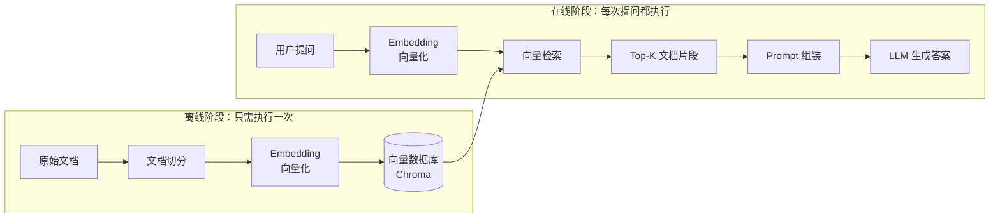

### 为什么需要 RAG？

| 方式 | 原理 | 优点 | 缺点 |
|-----|------|------|------|
| 纯 LLM | 依赖训练数据 | 通用知识强 | 不知道你的私有文档；可能幻觉 |
| **RAG** | **LLM + 实时检索** | **基于事实，可溯源；随时更新知识库** | **需要维护向量库；检索质量决定上限** |
| Fine-tuning | 用私有数据重新训练模型 | 知识内化到模型里 | 成本高；训练后知识固定，更新需重训 |

**一句话：RAG 是最快、最灵活的给 LLM 接私有知识的方式。**

---

## 二、5 个版本的演进全景

本项目实现了 5 个逐步优化的 RAG 版本，每一版都在前一版的基础上解决一个具体问题。

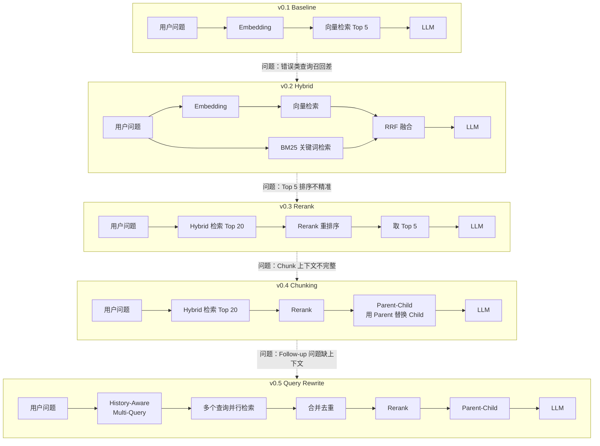

### 各版本解决的核心问题

| 版本 | 新增能力 | 解决什么问题 | 关键指标变化 |
|-----|---------|------------|------------|
| v0.1 | 纯向量检索 |  baseline | Recall@5: 48.3%, Acc: 63.3% |
| v0.2 | + BM25 混合检索 | 用户复制报错信息时召回率低 | Recall@5: 50.0%, Acc: 73.3% |
| v0.3 | + Rerank 重排序 | 召回的 20 个文档里 Top 5 不够准 | Recall@5: 56.7%, Acc: 73.3% |
| v0.4 | + Markdown 切分 + Parent-Child | 固定切分把完整概念切断，上下文不足 | Recall@5: 50.0%, Acc: **80.0%** |
| v0.5 | + Query Rewriting | Follow-up 问题依赖上下文，单查询覆盖面不够 | Recall@5: 40.0%, Acc: 60.0% |

---

## 三、Embedding（嵌入）

### 原理

Embedding 是把文字变成一串数字（向量），使得**语义相近的文字在向量空间中距离近**。

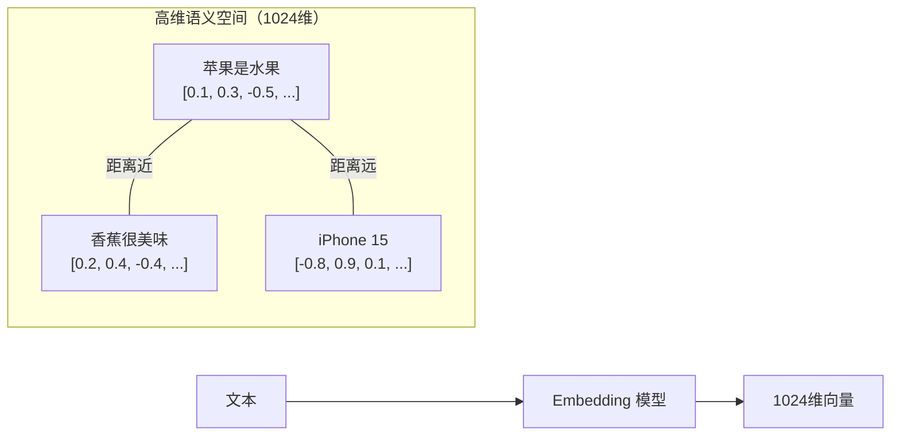

### 类比理解

想象一个图书馆：
- 每本书（文档 chunk）都被编码成一个"位置坐标"
- 你的问题也被编码成一个坐标
- 在向量空间里，距离最近的书就是语义最相关的

### 本项目使用的模型

| 模型 | 提供商 | 维度 | 特点 |
|-----|--------|------|------|
| `text-embedding-v3` | 阿里 DashScope | 1024 | 中文效果好，价格低 |

### 重要限制

**Embedding 是"静态"的**：它只训练到某个时间点，不知道最新的 API 变化。如果你的文档里有最新的 Next.js 15 特性，而 Embedding 模型训练时还没有这个信息——没关系，因为 Embedding 不是依赖训练数据来理解概念，而是依赖**向量空间的相对位置**。只要文档里有足够的上下文描述，模型就能把它和相近概念关联起来。

---

## 四、向量数据库

### 工作流程

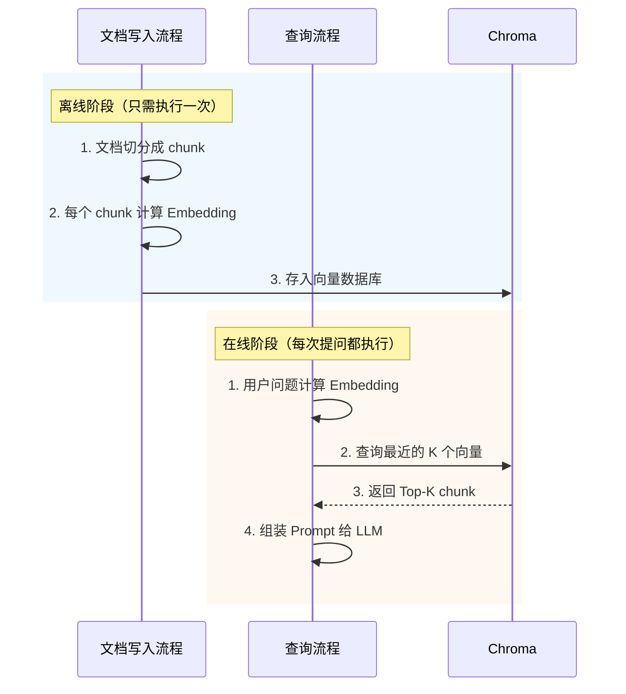

### 相似度搜索的本质

向量数据库不"理解"你的问题，它只是做**高维空间里的最近邻搜索**：

```
问题向量 ──距离计算──> 文档A向量 (距离: 0.3)
              ──距离计算──> 文档B向量 (距离: 0.5)
              ──距离计算──> 文档C向量 (距离: 0.8)

返回距离最小的 K 个（即最相似的 K 个）
```

距离计算通常用**余弦相似度**（cosine similarity）：两个向量夹角越小，相似度越高。Chroma 默认使用的就是余弦相似度。

### Chroma 的 C/S 架构

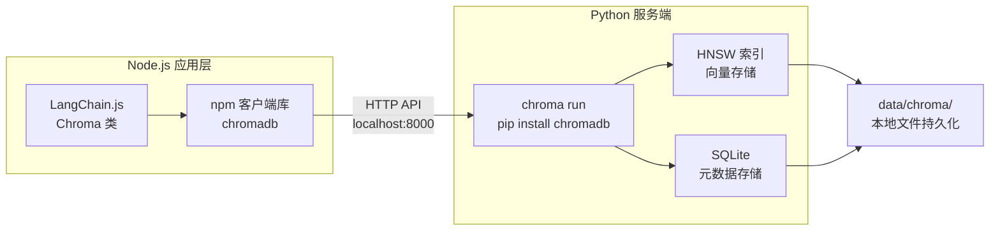

- `pip install chromadb` → 装的是**服务端**，`chroma run` 启动它
- `npm install chromadb` → 装的是**JS 客户端**，被 LangChain.js 间接依赖

两者缺一不可。详见 README [FAQ Q1](README.md#q1-chroma-不是有-npm-包吗为什么还需要-pip-安装)。

---

## 五、BM25 关键词检索

### 原理

BM25 是经典的关键词检索算法，计算"文档中出现查询词的频率"来打分。

```mermaid
flowchart LR
    Q[用户查询<br/>"hydration failed"] --> BM25
    subgraph 文档库
        D1["文档A：<br/>hydration failed...<br/>score: 8.5"] --> BM25
        D2["文档B：<br/>rendering...<br/>score: 0.2"] --> BM25
        D3["文档C：<br/>error handling...<br/>score: 1.1"] --> BM25
    end
    BM25 --> Result["按分数排序<br/>返回 Top-K"]
```

### BM25 考虑三个因素

| 因素 | 说明 | 举例 |
|-----|------|------|
| **词频 (TF)** | query 里的词在文档中出现多少次 | "hydration" 出现 3 次 > 出现 1 次 |
| **逆文档频率 (IDF)** | 这个词在所有文档中有多稀有 | "hydration" 只在 2 篇文档出现 → 权重高 |
| **文档长度归一化** | 长文档里出现同样的词，权重略低 | 10000 字文档里出现 1 次 < 100 字文档里出现 1 次 |

### 什么时候 BM25 比向量检索强？

| 查询类型 | 例子 | 向量检索 | BM25 |
|---------|------|---------|------|
| 概念性问题 | "What is App Router?" | 强（语义匹配） | 弱（关键词稀疏） |
| 错误排查 | "hydration failed" | 弱（语义空间不同） | **强（直接关键词命中）** |
| API 用法 | "usePathname usage" | 中等 | 中等 |
| 专有名词 | "next.config.js" | 中等 | **强（精确匹配）** |

### 为什么需要 Hybrid（混合）？

因为向量检索和 BM25 是**互补**的：
- 向量检索擅长"意思相近但用词不同"
- BM25 擅长"用户直接复制了文档里的关键词"

两者结合 = 覆盖更多查询场景。

---

## 六、RRF 融合算法

### 为什么需要融合？

向量检索和 BM25 各自返回一个排序列表，但它们的分数不可直接比较（一个是余弦相似度，一个是 BM25 分数）。我们需要一种**与具体分数无关**的融合方法。

### RRF 公式

```
RRF_score(d) = sum(1 / (k + rank_i(d)))

其中：
- k = 60（平滑常数，防止高排名垄断）
- rank_i(d) = 文档 d 在第 i 个检索器中的排名（从 0 开始）
```

### 直观理解

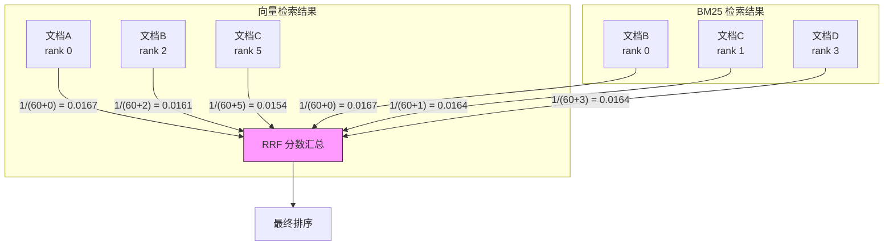

**举例**：
- 文档A：只在向量检索里出现（rank 0）→ RRF = 1/60 = 0.0167
- 文档B：向量 rank 2 + BM25 rank 0 → RRF = 1/62 + 1/60 = 0.0328 ← **最高分**
- 文档C：向量 rank 5 + BM25 rank 1 → RRF = 1/65 + 1/61 = 0.0313

**结论**：在两个检索器里都排名靠前的文档，融合后得分最高。单一检索器里排名第一但另一个没出现的文档，不如两个都靠前的文档。

### 权重调整

EnsembleRetriever 支持给不同检索器设置权重：

```typescript
new EnsembleRetriever({
  retrievers: [vectorRetriever, bm25Retriever],
  weights: [0.6, 0.4],  // 向量 60% + BM25 40%
});
```

权重会影响最终融合分数的加权计算。

---

## 七、Rerank（重排序）

### 检索 vs Rerank 的区别

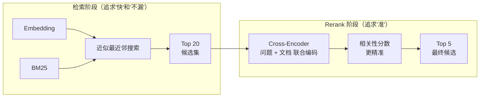

| | 检索（Retrieval） | 重排序（Rerank） |
|---|---|---|
| **目的** | 快速召回候选 | 精确排序候选 |
| **速度** | 快（毫秒级） | 稍慢（百毫秒级） |
| **精度** | 中（Embedding 是"单向"的） | 高（Cross-Encoder 是"双向交互"的） |
| **模型** | Bi-Encoder（分别编码问题和文档） | Cross-Encoder（问题和文档一起编码） |
| **计算成本** | 低（向量点积/余弦） | 高（需要模型前向传播） |

### 为什么 Cross-Encoder 更准？

**Bi-Encoder（Embedding 检索）**：
```
问题 ──编码──> 向量A
文档 ──编码──> 向量B
相似度 = 向量A · 向量B（点积）
```
问题和文档是**分别编码**的，模型看不到它们的交互。

**Cross-Encoder（Rerank）**：
```
[CLS] 问题 [SEP] 文档 [SEP] ──编码──> 相关性分数
```
问题和文档**一起输入**模型，模型可以看到每个词和另一个句子中每个词的交互，所以判断更准确。

### 代价

Cross-Encoder 需要对每个（问题，文档）对做一次模型推理，所以：
- 不能对百万级文档做（太慢）
- 但可以对检索阶段召回的 Top 20~100 做（完全可接受）

**这就是两阶段检索的本质：第一阶段快速筛掉明显不相关的，第二阶段精细排序。**

---

## 八、Parent-Child Chunking

### 核心矛盾

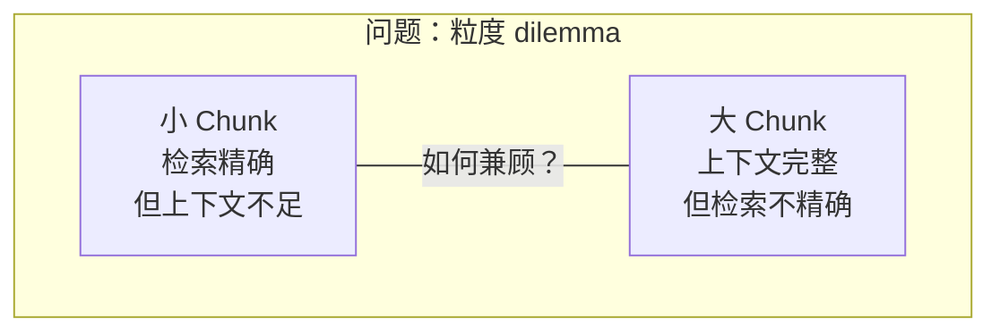

| Chunk 大小 | 检索效果 | 生成效果 | 原因 |
|-----------|---------|---------|------|
| 小（100~200字） | 精确 | 差 | 只包含片段，LLM 看不到完整解释 |
| 大（1000+字） | 模糊 | 好 | 包含完整上下文，但混入不相关内容 |

### Parent-Child 解法

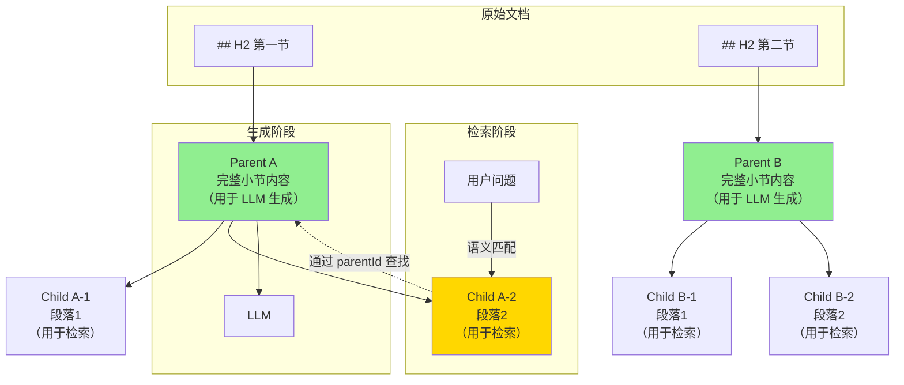

**流程**：
1. **切分**：按 H2 标题切分文档，每个 H2 小节是一个 Parent
2. **细分**：每个 Parent 再切成若干 Child（按段落）
3. **存储**：Child 存入向量数据库（带 `parentId` 指向 Parent）
4. **检索**：用 Child 做语义检索（小粒度 = 精确）
5. **生成**：通过 `parentId` 找到对应的 Parent，把完整 Parent 内容传给 LLM（大粒度 = 完整上下文）

### 类比

- **Child** = 图书馆的目录卡片（精确索引，方便查找）
- **Parent** = 目录对应的完整书籍（提供完整内容，供阅读）

---

## 九、Query Rewriting（查询改写）

### 为什么需要改写？

| 场景 | 原始问题 | 问题 |
|-----|---------|------|
| 多义词覆盖 | "rendering" | 可能指 SSR、CSR、React 渲染等多种含义 |
| Follow-up | "How is it different?" | 必须知道"it"指什么，"different from what" |
| 术语差异 | "怎么读取路径" | 用户可能用口语，文档用术语 "usePathname" |

### Multi-Query 改写

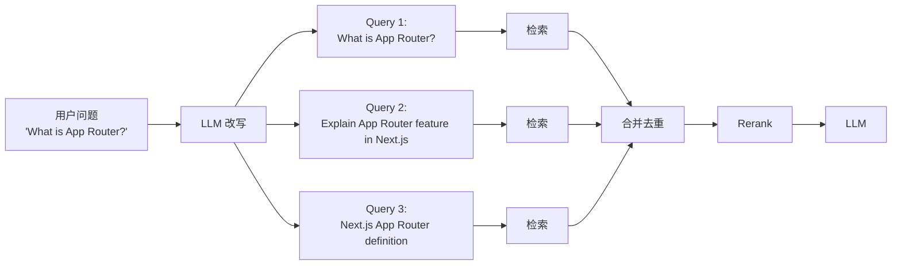

**好处**：不同表述覆盖了更多相关文档，减少因为"用词不同"导致的漏召。

**代价**：可能引入噪声（某个变体 query 召回了不相关文档）。需要调参控制：
- 变体数量（2~3 个为宜）
- 变体质量（过滤掉和原问题相似度太低的）

### History-Aware 改写

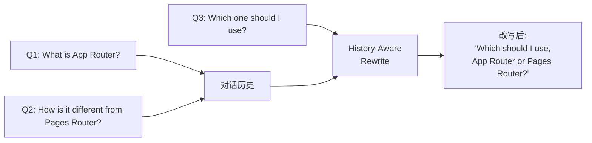

Follow-up 问题往往有指代（"it"、"which one"），需要结合历史把问题改写成**自包含的完整问题**。

---

## 十、可调参数一览

### 1. 文档切分参数

**文件**：`scripts/ingest.ts`

```typescript
const splitter = new RecursiveCharacterTextSplitter({
  chunkSize: 500,    // 每个 chunk 的最大字符数
  chunkOverlap: 50,  // 相邻 chunk 之间的重叠字符数
});
```

| 参数 | 默认值 | 调大效果 | 调小效果 |
|------|--------|---------|---------|
| `chunkSize` | 500 | 单个 chunk 包含更多上下文，但可能混入不相关内容 | chunk 更聚焦，但可能把完整概念切断 |
| `chunkOverlap` | 50 | 减少断句问题，相邻 chunk 重复更多 | 节省存储，但可能丢失上下文衔接 |

**建议**：
- 技术文档用 500~1000，保证一个 chunk 内包含完整的代码块或段落
- chunkOverlap 设为 chunkSize 的 10% 左右（如 500/50、1000/100）

---

### 2. 检索数量参数

**文件**：各 pipeline 的检索调用处

```typescript
// v0.1: 直接取 top 5
const docs = await vectorStore.similaritySearch(question, 5);

// v0.2/v0.3: Hybrid 检索取 top 20，然后 Rerank 取 top 5
const ensemble = new EnsembleRetriever({ ... });
const docs = await ensemble.invoke(question);  // 默认返回融合后的结果

// v0.3 Rerank 阶段
const reranked = await rerank(question, docs, 5);  // 从 20 个里取 top 5
```

| 参数 | 作用 | 调大效果 | 调小效果 |
|------|------|---------|---------|
| 检索阶段的 k | 召回候选数量 | 召回更多潜在相关文档，但增加噪声 | 更精准，但可能漏掉相关内容 |
| Rerank 后的 k | 最终传给 LLM 的 chunk 数 | LLM 看到更多上下文，但可能注意力分散 | 上下文更聚焦，但可能信息不足 |

**建议**：
- 检索阶段 k=20（追求"不漏"）
- Rerank 后 k=5（追求"最准"）
- 如果 LLM 的 context window 很大（如 128k），可以调到 10

---

### 3. Hybrid 检索权重

**文件**：`src/retrieval/hybrid.ts`

```typescript
new EnsembleRetriever({
  retrievers: [vectorRetriever, bm25Retriever],
  weights: [0.6, 0.4],  // 向量 : BM25
});
```

| 场景 | 推荐权重 |
|------|---------|
| 通用问题（概念、API 用法） | 0.6 : 0.4（默认） |
| 错误排查（复制了报错信息） | 0.3 : 0.7（BM25 权重更高） |
| 语义理解型问题（"怎么实现 XXX"） | 0.7 : 0.3（向量权重更高） |

---

### 4. LLM 参数

**文件**：`src/lib/llm.ts`

```typescript
new ChatOpenAI({
  model: 'deepseek-v4-pro',
  temperature: 0,      // 创造性 vs 确定性
  maxTokens: 1024,     // 最大输出长度
});
```

| 参数 | 默认值 | 说明 |
|------|--------|------|
| `temperature` | 0 | 0 = 最确定，每次输出一样；调高会更有创造性，但 RAG 答案最好稳定 |
| `maxTokens` | 1024 | 根据答案长度调整。简单事实 256 就够，复杂对比可能需要 2048 |

---

### 5. Embedding 批量参数

**文件**：`src/lib/embeddings.ts`

```typescript
new DashScopeEmbeddings({
  modelName: 'text-embedding-v3',
  batchSize: 10,  // 阿里限制每次最多 10 条
});
```

**注意**：不同提供商的限制不同：
- 阿里 DashScope：batchSize <= 10
- OpenAI：batchSize <= 2048
- 调大 batchSize 可以加速 ingest，但不要超过服务商限制

---

### 6. RRF 融合常数

**文件**：`src/retrieval/hybrid.ts`（通过 `EnsembleRetriever` 内部实现）

RRF（Reciprocal Rank Fusion）公式：
```
score = sum(1 / (k + rank))
```

- `k` 默认 60，是防止高排名垄断的平滑常数
- 一般不需要调，60 是论文推荐值

---

## 十一、参数调优流程

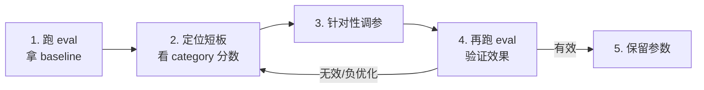

**常见短板和调参方向**：

| 短板 | 表现 | 调参方向 |
|-----|------|---------|
| troubleshooting 差 | 错误类问题召回低 | 调高 BM25 权重，或增大 chunkOverlap 保留更多错误上下文 |
| cross-doc 差 | 跨文档问题召回低 | 增大 chunkSize，或用 Parent-Child 切分 |
| evolution 差 | 对比/演变类问题答不准 | 加 Rerank 或 Query Rewriting |
| 答案太长/太短 | 生成质量不稳定 | 调整 maxTokens 或 temperature |
| ingest 太慢 | 写入向量库耗时 | 调大 batchSize（不超过服务商限制） |

---

## 十二、概念速查表

| 概念 | 一句话解释 | 在本项目中的位置 |
|-----|-----------|----------------|
| Embedding | 把文字变成向量，语义相近的向量距离近 | `src/lib/embeddings.ts` |
| 向量数据库 | 存储向量，支持快速最近邻搜索 | `src/lib/chroma.ts` |
| BM25 | 关键词检索，看词频和稀有度 | `src/retrieval/hybrid.ts` |
| Hybrid | 向量 + BM25 同时检索，RRF 融合 | `src/retrieval/hybrid.ts` |
| Rerank | 用 Cross-Encoder 精细排序候选 | `src/reranking/dashscope.ts` |
| Parent-Child | 小 chunk 检索，大 chunk 生成 | `src/chunking/markdown-aware.ts` |
| Query Rewrite | 把一个问题改写成多个变体再检索 | `src/query-rewriting/multi-query.ts` |
| RRF | Reciprocal Rank Fusion，融合多个排序列表 | `EnsembleRetriever` 内部 |
| Recall@5 | 前 5 个结果中召回了多少预期文档 | `src/eval/metrics.ts` |
